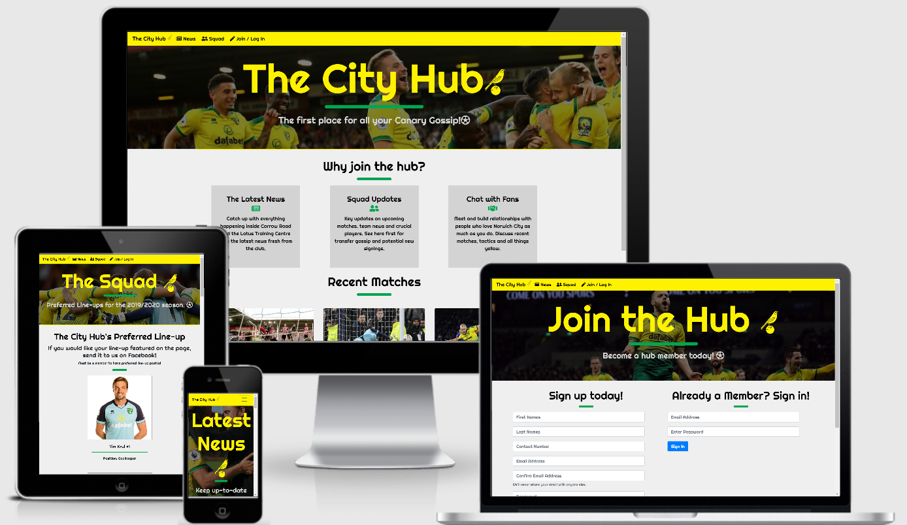

# The-City-Hub

The City Hub is a fan-site aimed at the supporters of Norwich City Football Club. Aiming to bring updated information to members of the hub. Allowing to interect with each other and have their own input into the site, the line-up sections.

# UX
The purpose of the site is to provide a platform for fans to see information about their club.

## User Stories
As a football fan, I look for a site that has relevant information about my team. An avenue in which i can talk to others about opinions, tactics and players.

# Features
## Existing Features 
### Home page
On the home page there are reasons to 'join the hub'. Following these are recent match reports, with an active link to the official reports on the official Norwich City Website.
### News
This page provides the user with the recent updates from the club, snippets of information are on the page, with the option to view more at the click of a button. Transfers and Gossip are also available to see.
### The Squad
A visually representation of a line-up preferred by the City Hub, with the option of members to have their own preferred line-up through social media.
### Join / Log in
A page where new users can become a site member, and existing members can sign in.
### Navigation, Header and Footer
Each page has the same navigation bar and footer, so the user is able to navigate between the pages conveniently. The layout and design of each page is consistent with each other, except for the heading images and content.

# Technologies Used
## HTML (Hyper Text Markup Language)
Used to build the pages of this website.
## CSS (Cascading Style Sheets):
I used this language to style my HTML pages through alignment, spacing and colour scheme.
## Bootstrap
This is a CSS framework that assist the developer in creating mobile responsive front-end projects.
## Chrome Developer Tools
Web developer tools integrated in Google Chrome. Used to inspect the site on various mobile devices.
## GitPod
An online IDE in which the HTML and CSS code was created and tested.
## GitHub
A website which works with GitPod, it provides hosting for software development version control using Git.
## W3C Code Validation
This was used to validate the HTML and CSS, which notifies you of any errors.
## Beautifier.io
An online services which beautifies and formats your code to look more professional.

# Testing
## Desktop / Laptop
The site has been tested on Google Chrome and Internet Explorer. The content is displayed well on all viewports. 
## Mobile Devices
Using the Chrome Developer Tools, a various range of mobile devices were tested on. The site responds well with all the following devices viewports;
- Galaxy S5 - Google Pixel 2 - Google Pixel 2 XL - iPhone 5 / 6 / 7 / 8 / X - iPhone 6+ / 7+ / 8+ / X+ - iPad - iPad Pro 
The site was also tested on my own Samsung S10+ and responded well to this, the images, content and links were clear and precise. 

# Feedback
The project was sent to a football fan, who did not support Norwich City, to get an insight into what they thought about the website.
"You can easily access the content, get what its about. Its an advanced fan base with access to real news and gossip, easy to distinguish which is which"

# Deployment
- The project was created thought GitHub and developed on GitPod.
- All files/images used to create the site have been uploaded to GitPod and GitHub respectively.
- To see the project published on Google Chrome, I selected the master branch in the GitHub settings and saved. This allowed the following url to be used to view the site in Google Chrome.
- To view the code used, please visit the GitHub page for The City Hub.

# Credits
## Content
1. Bootstrap;
 - Card Template for displaying information on Home, News and Squad pages.
 - Form layout used for Join / Log In page.
 - Mobile responsive display, used in cohesion with JavaScript to make the site responsive on all devices, providing Burger Menu icon.
2. Google Fonts; for the font style used across the site; Righteous.
3. Norwich City Football Club Website; for information on recent news and match reports

## Media
1. Norwich City Football Club Website, squad page; used for the images to create the line-ups section.
2. Google Images; allowing me to find suitbale images for the site. 
3. Font Awesome; for the icons used across the site header and footer.
4. Am I Responsive Web Design for displaying the viewport for each device, as seen in the image at the beginning of this document.

## Acknowledgements
1. Adegbenga Adeye - Code Institute Mentor - for development and desgin guidance and advice on the project.
2. The Code Institute Slack Coomunity - for inspiration and the lively community it has.
3. Oliver Henderson - for giving feedback on finalised project.
